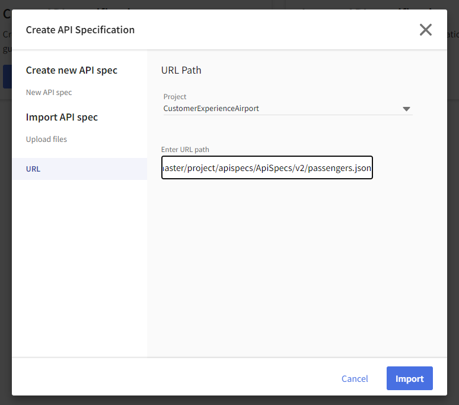

# Create an API Spec  
## Overview
In this hands-on lab you will import an existing API specification into TIBCO Connected Intelligence Cloud and explore the API.  The goal is to give you a best practice overview of an API that you can leverage in future projects.  

### Get Started  

Sign into TIBCO Cloud and open API Modeler from the Development Tools menu on the home page.

1)	Start at new TIBCO Cloud Home Page.
")

2)	Select Development Tools dropdown.
3)	Select API Modeler.  

### Create Project

Let’s create a Project to organize your APIs.

1)	Click the blue Create new button and select Project.  

2)  Name your project **CustomerExperienceAirport** and press Create.

  
### Import API Spec  

API Modeler allows you to start from scratch or start with a existing specification that you can import from your file system or a URL.  We are going to start with a existing API spec that will be imported from a URL.

1)	Select the "Import" button and then, under Import API Spec, select URL.
2)	Paste in and Import: `https://raw.githubusercontent.com/TIBCOUK/Keys2Cloud/master/project/apispecs/ApiSpecs/v2/passengers.json`

3) Click on the Pen icon next to the imported name and update the generated name with **PassengerAPI**

### Explore API Spec

Now let’s explore the passenger API spec.  The purpose of this exploration is to showcase best practices as discussed in the above sections.

1)	Under PassengerAPI in the left hand menu select the /v2/passengers/{passengerid} resource.
2)	The GET method is highlighted and the request is shown.  The /v2/passengers/{passengerid} is the path developers will use to access this resource, the API is expecting a passengerid to be passed to it in the request.
3)	Select Response.  200 and 404 responses have been specified.  200 is the success response and 404 will be returned if no passenger is found for {passengerid}.

4)	Select Response 200/OK by clicking on "Show More".  This shows the response schema in JSON and YAML formats along with an example of the response data.  The passenger API spec is telling us that this API will respond with passenger details that include passengerid, name, street, city, and zip code. Click on "Show less" to collapse this view. 

5)	Explore some more!  SelectResource /v2/passengers.  Resources for POST, GET, PUT and PATCH have been specified. 

### API Docs

The API Docs (Select Docs on the right hand menu) gives you a complete overview of the structure of your API along with input parameters, output responses and samples, in the familiar "Swagger" api view.  

You can share this API specification with anyone in your organization and solicited feedback before you begin to implement.  This supports continuous planning and is a best practice development methodology.  
  
### Summary
API Specification on the TIBCO Connected Intelligence Cloud platform enables you to create blueprint structures for your APIs using a browser-based web GUI. Allows you to collaborate with others in your organizations to get early feedback and allow you to identify needed changes earlier in the API lifecycle.
  
Next step: [Create Mock API](1.mockapi.md)
