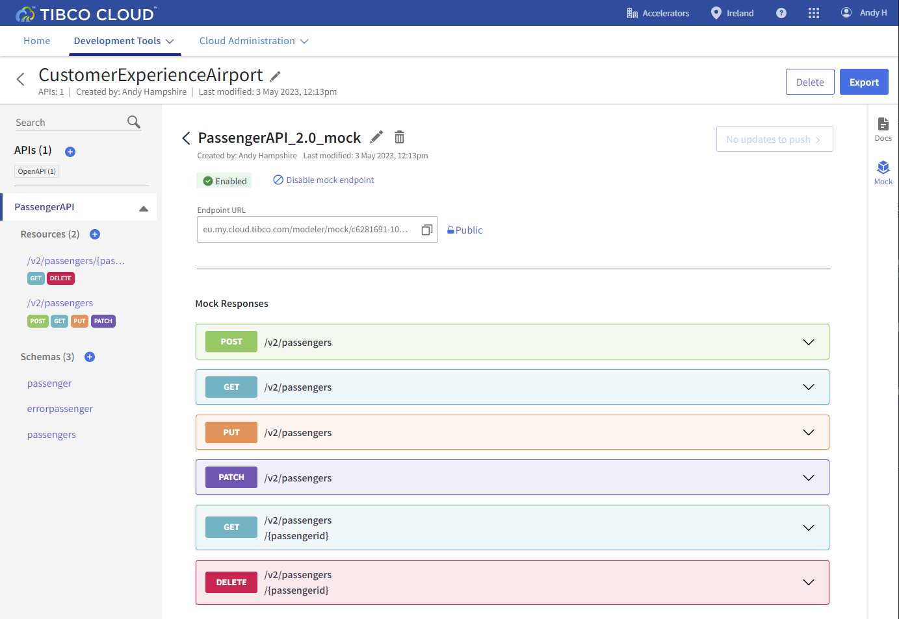

# Mock API

## Overview
In this hands-on lab you will create a mock API for passengers.  It’s really a good idea to fake it before you make it!  Teams can create mock services to indicate what they need an API to do.  Architects and developers can get a head start on their work by leveraging the Mock API well before the implemented API goes into production; and can also provide feedback and changes earlier in the API development lifecycle. Supports continuous planning, development, and testing.

### Get Started

Start by having your API Specs Project **CustomerExperienceAirport** open.  Select **PassengerAPI** in the left hand menu or any of the definitions below.

### Create Mock App

From the right hand menu select **Mock**

Click "Start Mocking". This will create a mock application for passengers from your passenger API spec.

Once generation has completed you will be presented with the following interactive documentation where you get test the mock responses.

  
### Test

This next section will show you how to test your mock application end points.

1)	Select the down-arrow to the right of "Get /v2/passengers".
2)	Select Try it out! Under GET /v2/passengers.

3)	Click execute and your request for passengers will return a list of passengers.
Also note that it will give you sample CURL commands and for a simple get a URL that you can use in a browser session.

4)	Let’s try testing /v2/passengers/{passengerid}. 
Scroll down to /v2/passengers/{passengerid} and expand.Click **Try it out!** to enable the form. 
Enter 11111 in passengerid parameter and click **Execute**
5)	Your request for /v2/passengers/11111 will return passenger details.

  
### Summary

Creating Mock Apps is as simple as a mouse click on TIBCO Connected Intelligence Cloud.  In this section we leveraged the passengers API and generated and deployed a mock passengers app to the cloud and tested the API end point.
  
Next step: [Implement API Internals](2.apiimplementation.md)
