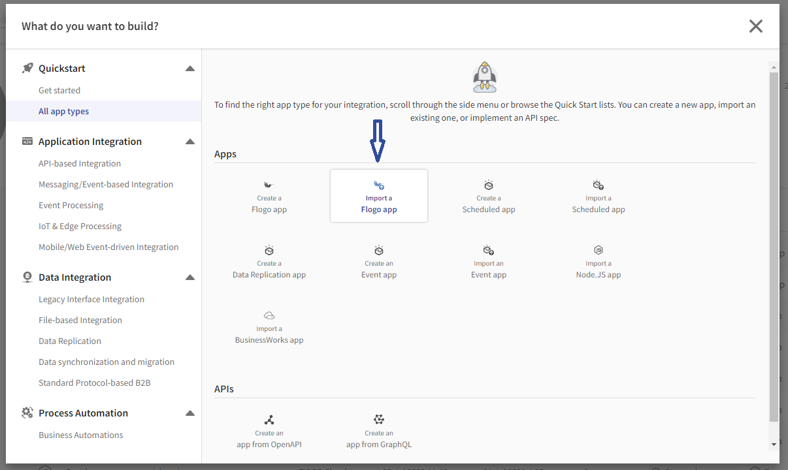
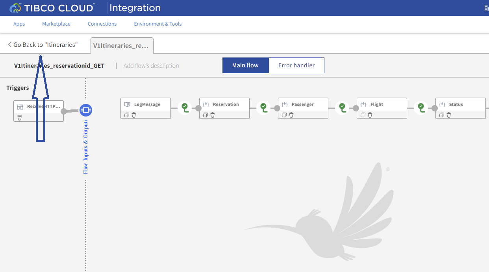

# API Implementation and Reuse

## Overview
In this hands-on lab you will extend itineraries API implementation by reusing **aircrafts API**.  The current itineraries API responds with reservation, passenger, flight and status details.  We want to also include aircraft details.  

### Prerequisites
 To complete this exercise you will need to download the [v1_itineraries_todo.json](https://raw.githubusercontent.com/TIBCOUK/Keys2Cloud/master/project/apispecs/TCI/Itineraries_lab/v1_itineraries_todo.json) 

### Get Started

Start by signing into TIBCO Cloud and opening Integration (Flogo).


1)	Start on the Home page of your TIBCO Cloud.
2)	Select Integration.

### Import Application
 
We are going to use a prebuilt application for this hands-on lab and extend it by reusing flights API. 

1)	Select Create/Import (Top right). This displays the Create Wizard.
2)	On the left hand menu under **Quickstart** select **All app types**.



3)	Select **Import a Flogo app**.
4)	Either browse for or drag and drop the downloaded file **v1_itineraries_todo.json**


5)	Press **Import Flogo app**
6)  Click into the generated app name and rename the app to **Itineraries**


7)	You are now ready to extend this API with aircraft details.
  
### Extend and Reuse API

Let’s extend the **itineraries API** to include aircrafts details.

1)	Select **V1Itineraries_reservationid_GET**.  GET /itineraries/{reservationid} implementation will be opened.  Here you see the orchestration that invokes **reservations**, **passengers**, **flights**, and **statuses** APIs.  You are now going invoke an API call to **aircrafts** in the next steps.


2)	At the end of the line of activities, Hover your mouse over the gray line and select the **+** to add a new activity.
3)	From Add Activity, scroll down, select General, select Invoke REST Service. 


4)	Drag the InvokeRESTService to the left and drop between the Status activity and the Return.
5)	Now let’s configure the Invoke Rest Service activity.  
6)	Let’s rename this activity.  Select InvokeRESTService, hover your mouse over the name InvokeRESTService and select the edit icon.  
7)	Rename **InvokeRESTService** to **Aircraft**.

8)  Select **Settings** and paste the following URL in URL field.
  `https://eu-west-1.integration.cloud.tibcoapps.com:443/nhj5x7yul7x5x3v6alu5cysgmuckp2xz/v1/aircrafts/{aircraftid}`


9)  Now let’s map activity input.  
Select **Input** tab. 
Under **Activity inputs** expand pathparams then expand Available data->Reservation->responseBody->reservation
Select aircraftid and drag it to aircraftId.


10) Configure the Output settings.  
Select **Output Settings** and paste the following schema into Response Schema.
```
{"aircraft":
    {"aircraftid":"111",
    "type":"767",
    "seatcapacity":"280"}
}
```


11) Click Save
12) Let’s map the aircraft details into the Return activity (Last step on the flow diagram).  
Select Return activity  

Expand Flow Outputs itinerary and select aircraft. 
In upstream Output Aircraft, expand Aircraft->responseBody, select aircraft. 
Drag the **aircraft** object to the flow output aircraft object to map it.
13) Click Save


### Updating Endpoints for other REST Activities
There are a number of REST Activities in the example application that you may need to update. These are all Mock Applications that always return the same data. The current endpoints for these activities (From May 2022) are as follows:

| Activity Name |	URL Value |
| ----------- | ------------- |
|Reservation | `https://eu-west-1.integration.cloud.tibcoapps.com/ca7huojn6n56ihyqqy3ue5ylu4sxaoiy/v1/reservations/{reservationid}` |
|Passenger | `https://eu-west-1.integration.cloud.tibcoapps.com/374hobh5v5frvvpdiuzljyxjncqmurbh/v1/passengers/{passengerid}`
|Flight | `https://eu-west-1.integration.cloud.tibcoapps.com/kg7aidkcdpozdjphaclcr2w6rmtsjrhm/v1/flights/{flightid}`
|Status | `https://eu-west-1.integration.cloud.tibcoapps.com/bzl7j4xgd3x4twq73zmwwwqxr27mhb4k/v1/statuses/{flightid}`
|Aircraft (should you not wish to deploy your own as above):| `https://eu-west-1.integration.cloud.tibcoapps.com/nhj5x7yul7x5x3v6alu5cysgmuckp2xz/v1/aircrafts/{aircraftid}` |

  
### Start Testing

In this section we will test **itineraries API** implementation.

1)	Select **Test**.
2)	Select Create a Launch Configuration.


3)	Expand Activity Input flowInputs->pathParams->reservationid.  And enter "AAAAA11111" into flowInputs.  Use quotes.  Select Next. Select Run.


4)	Your Test should run to completion without any errors.  Scroll down the log to see the run messages. Select an activity tile to see the data. Select the **Return** and confirm that aircraft details were added to the response.


5)	Select Stop Testing. 
6)  Navigate back to the "flows" view by clicking the back button in the UI



### Push App

In this section we are going to push the itineraries app to the cloud and test the live endpoints.

1)	Select Push app. The itineraries app with be pushed to the cloud.


2)  The app status will change to Deploying, after a short while (20 seconds) will show "Stopped"


3)	 Once it has been deployed you will need to scale it one instance. Update the count and press scale, after a short while (30 seconds) will show "Running"


4)	Once it is scaled and in a running state you can test your live endpoint by selecting **Endpoints**, Under Actions click Test.
5)	Click **Try it out!** Then enter AAAAA11111 for reserverationid input parameter and click **Execute**


### Summary
In this exercise you imported an application and extended by reusing **aircrafts API**.  You performed a local test and pushed the application to the cloud.  You finshed by testing the application's live endpoints.

The endpoints you used above are supplied by TIBCO. Next you will recreate the mock apps yourself to see how it can be done in Flogo. 

Next step: [Flogo Mock App](3.FlogoMock.md)

