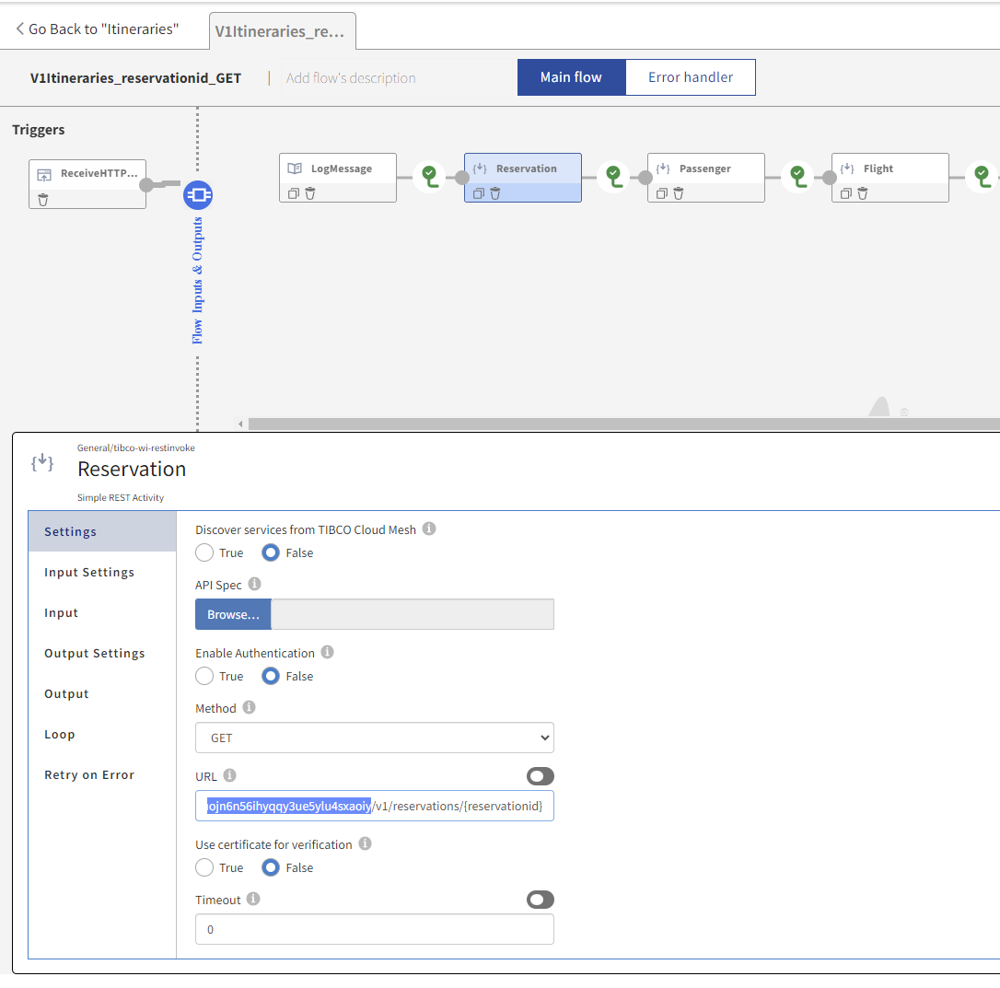
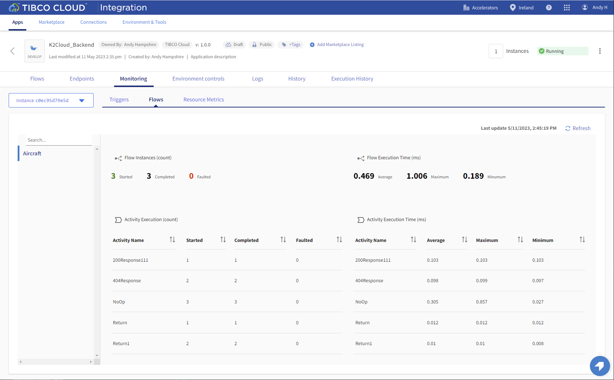
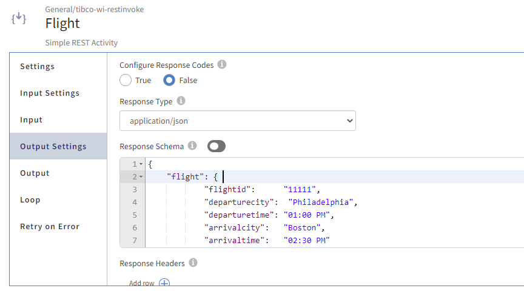

# Flogo Mock backend

 
## Overview
In this hands-on lab you will import the sample Flogo mock API. Even more optionally you can recreate this from the Swagger API definition!

### Prerequisites
 To complete this exercise you will need to download the [Keys2Cloud.json](https://github.com/TIBCOUK/Keys2Cloud/raw/master/project/apispecs/FlogoBackend/keys2Cloud.json) 

### Get Started

Start by signing into TIBCO Cloud and opening Flogo.

1)	Start on the Home page of your TIBCO Cloud.
2)	Select Integration.

### Import Application

We are going to use the prebuilt application for this hands-on lab. 

1)	Select Create/Import (Top right). This displays the Create Wizard.
2)	On the left hand menu under **Quickstart** select **All app types**.

3)	Select **Import a Flogo app**.
4)	Either browse for or drag and drop the downloaded file **Keys2Cloud.json**

5)	Press **Import Flogo app**
6)  Click into the generated app name and rename the app to **K2Cloud_Backend**

7)  Push the app and scale to 1

8)  Optionally test the API's from the Endpoint tab

9)  Now we need to update the **Itineries** app to use the new endpoints. First get the endpoint URL from the Endpoint tab of the **K2Cloud_Backend** app after having clicked **Test**.  

10)  Update each of the REST activities URL.... Make sure you only replace the URL upto the **/v1/**

11)  Push the Itineries app and test

12)  Verify the new API is being used from the Monitoring tab

### Service Mesh
Now that we have the Flogo mock app running within our organization we have the option of making the services private to the Org and access then via the Service Mesh.

1)  Open the **K2Cloud_Backend** app
2)  In the App details area you should see the **Public** icon. This tells you that the API's are available to anyone.

3)  To make these private and include them in the Org's service mesh, click the **Public** icon. 
On the Update panel click **Update**.

4)  The API's are now available via the mesh.
5)  Navigate back to the **Itineraries** app
6)  Open the **V1Itineraries_reservationid_GET** flow
7)  For each of the REST Invoke calls do the following:
    Set **Discover services from TIBCO Cloud Mesh** to **True**
    
    Click **Browse** 
    Find the Backend app and click the right arrowhead to expand the services
    
    Find the required service path and method. Click **Select**
    
8)  The updated service reference

9)  When using the Mesh there is a difference in the way that the outputs from the activity are mapped. So far the output has been overridden by specifying the output format.

When switching to the Mesh it enforces the API definition that defines multiple response types.
In this example we have changed the first step **Reservation** and the mapping on Passenger is wrong

To fix this change the mapping from 
`$activity[Reservation].responseBody.reservation.passengerid` to 
` $activity[Reservation].responseCodes["200"].reservation.passengerid`
You can remap in the mapper or manually change `responseBody` to `responseCodes["200"]`

10)  Once the activities have been updated to use the end points from the Service Mesh, redeploy (Push) the app.

Next step: [Import Offer API Engine](4.TCE.md)