# Cloud Events

## Overview

In this hands-on lab you will use Cloud Events to create a dynamic API that will respond with contextual offers.  Cloud Events will make decisions based on itineraries, gate information, flight status and passenger profile.  Cloud Events will respond with the best possible offer for the passenger.   

## Get Started

Start by signing into TIBCO Cloud and opening Events.

1)	Start on the Home page of your TIBCO Cloud.
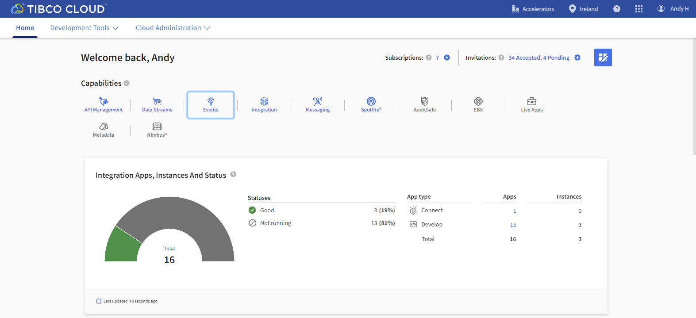

2)	Select Events.
2)	This gives you the Events home page
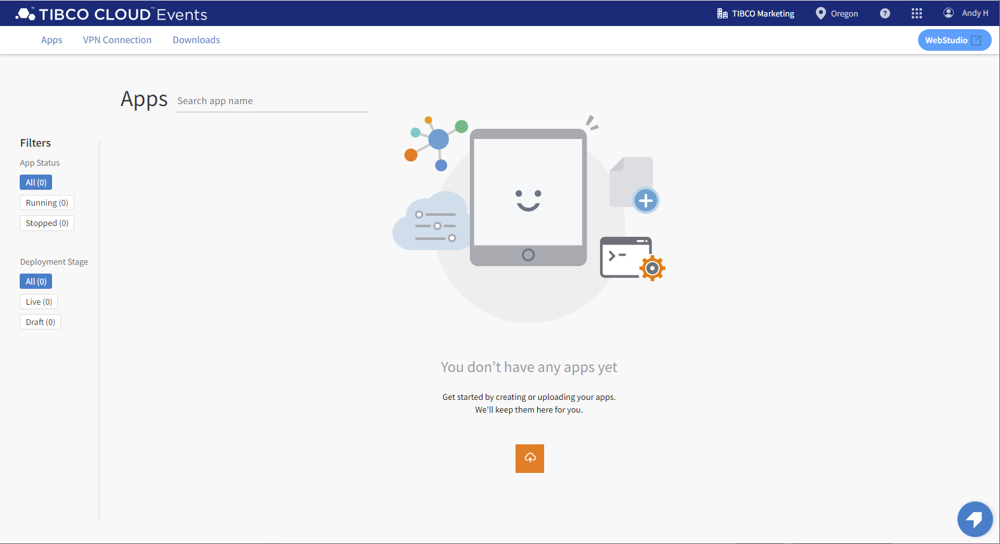

## Uploading Cloud Event Offer Project

For this exercise we are going to start with a prebuilt solution.  This solution will make an offer decision based on passenger loyalty and flight status. 

1)	The **You don’t have any apps yet** page should be opened.
2)	Select Upload, the orange cloud with up-arrow, to get the Upload wizard dialog.
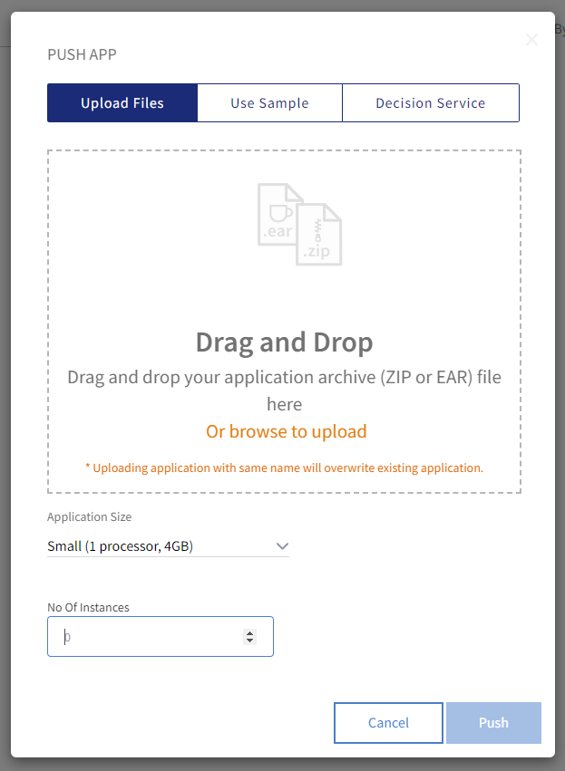

3) Download [PassengerOffer.ear](https://raw.githubusercontent.com/TIBCOUK/Keys2Cloud/master/project/cloudevents/PassengerOffer.ear)
4)	Either **Browse** to the download directory **Or** drag PassengerOffer.ear into Drag and Drop area. 
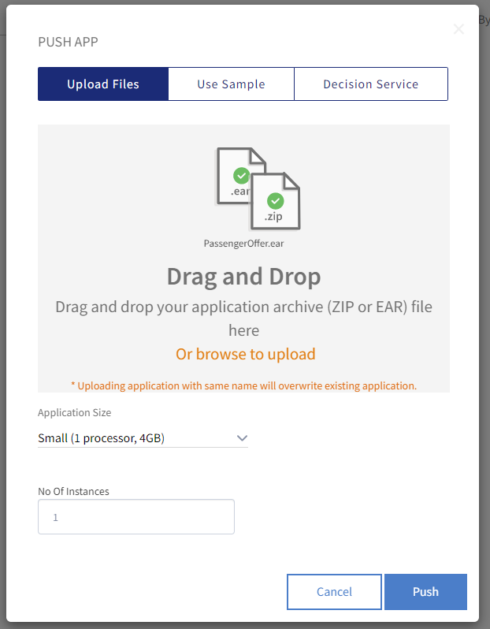

Set the application size (Only Small will be available on a Trial account)
Set the **No Of Instances** to 1 so that the app is started after it's deployed
Click **Push** to upload the file. 
5)	The PassengerOffer project files will be pushed to the cloud and started.

## Testing  PassengerOffer

1)	The PassengerOffer project should be shown as **Running**.
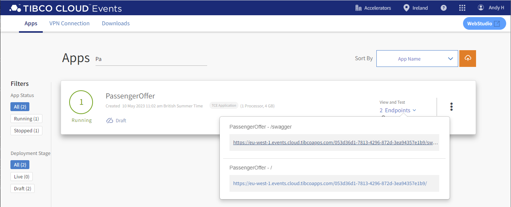

2)	Select **2 Endpoints** and choose PassengerOffer Swagger link.
3)	Expand GET Method and select Try it out.
4)	Enter sample values for parameters as shown in the table below and press Execute.
5)	For example the offer for a Silver customer with a Delay of 3 hours is, as shown below, is **Drinks At Bar**.
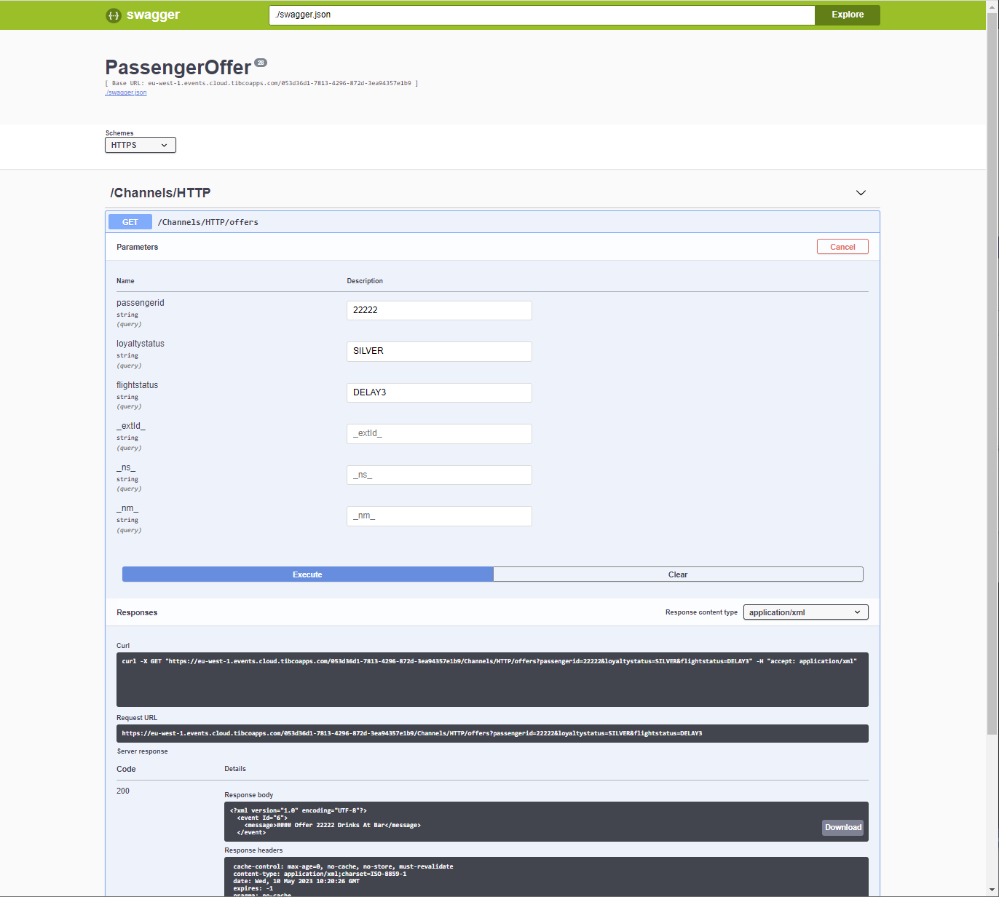

6)	Try a couple of different combinations of loyalty status and flight status. Use values in the table below.

| passengerid |	loyaltystatus |	flightstatus | action |
| ----------- | ------------- | ------------ | ------ |
| 11111       | BRONZE        | DELAY1       | No offer |
| 11111       | SILVER        | DELAY1       | No offer |
| 11111	      | GOLD          | DELAY1       | Offer |
| 11111	      | BRONZE        | DELAY2       | Offer |
| 11111	      | SILVER        | DELAY2       | Offer |
| 11111	      | GOLD          | DELAY2       | Offer |
| 11111	      | BRONZE        | DELAY3       | Offer |
| 11111	      | SILVER        | DELAY3       | Offer |
| 11111       | GOLD          | DELAY3       | Offer |

## Working with Cloud Events

In this next section we are going to make a change to the decision table.  Currently a passenger with SILVER loyalty and a 2-hour delayed flight is offered a Happy Meal.  We are going to change that offer to a Philly Cheesesteak and Coke.

1)	Navigate to Cloud Events Apps page by Logging into cloud.tibco.com and select Events.  You should see your running PassengerOffer App.
2)	You are going to use WebStudio to make changes to the Cloud Events decision table.  
3)	Select WebStudio. Top right on the apps list page.
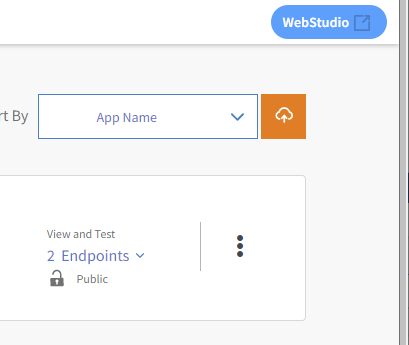

 Navigate to Dashboard.  
 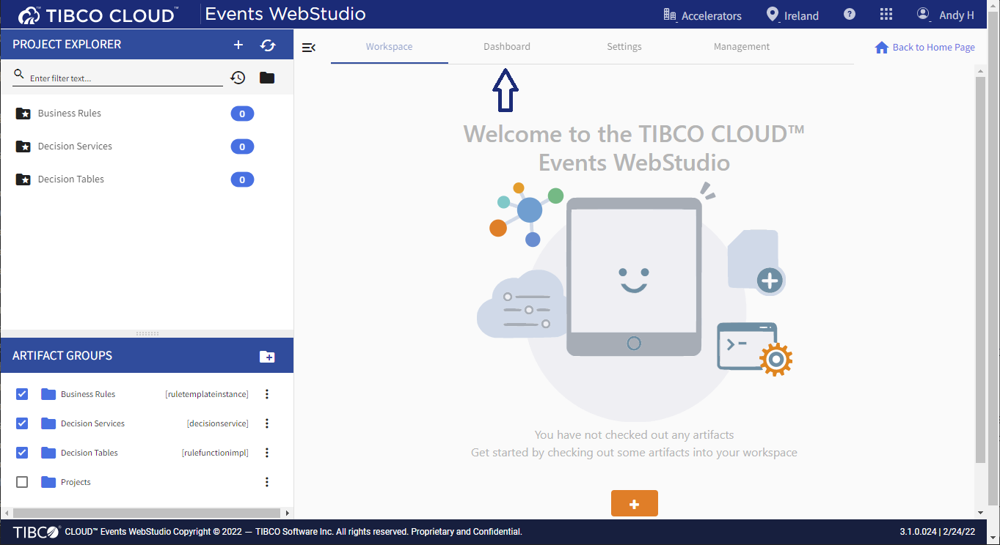

 The dashboard shows all recent activities. 
 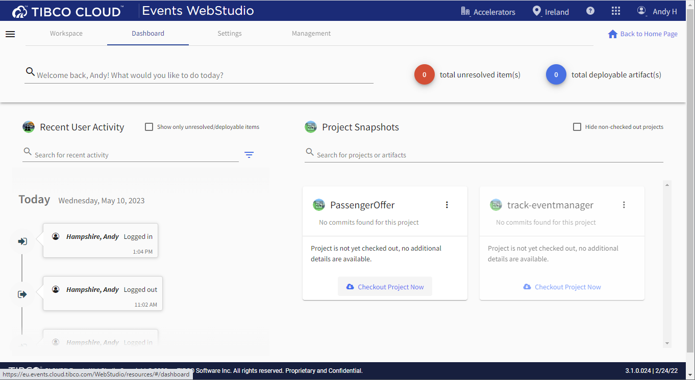

4)	On the PassengerOffer click **Checkout Project Now**. This will display the Artifacts in the project and show them selected ... Click on **Confirm** to check out all the PassengerOffer artifacts. This will return you to the Workspace tab.
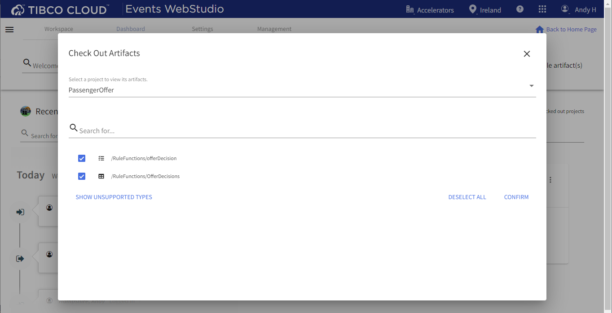

5)	You are going to make changes to the PassengerOffer decision table.  Select offerDecision from the ARTIFACTS list.
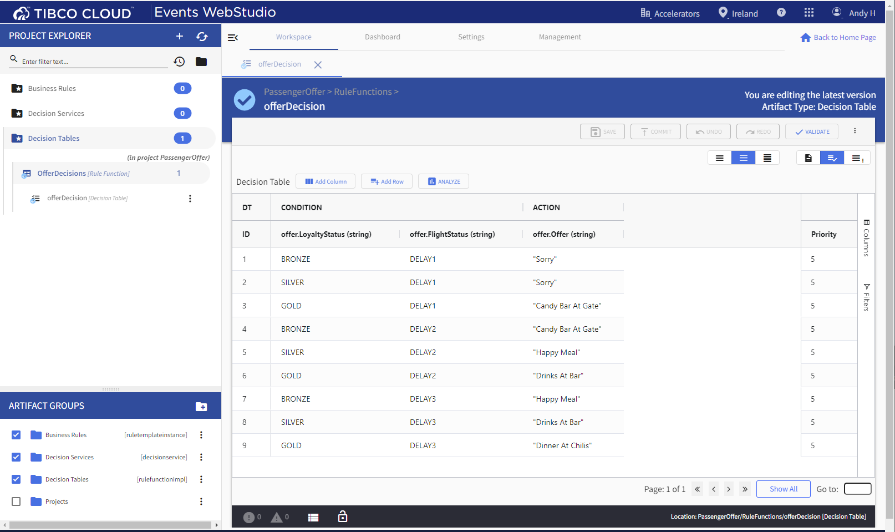

6)	In the offerDecision table scroll down to row 5 where SILVER, DELAY2 and "Happy Meal" is displayed.  

Change "Happy Meal" to "Philly Cheesesteak and Coke".  
Click Save.

7)	Commit your changes.  Click Commit, add a message and select Confirm.

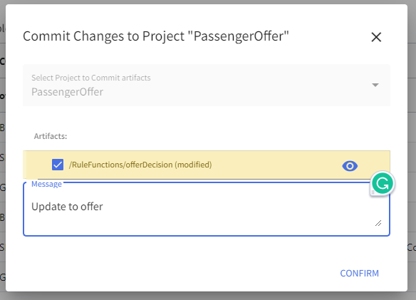

8)	From the three elipse menu navigate down to **Generate Project Deployable**. Click **Confirm**
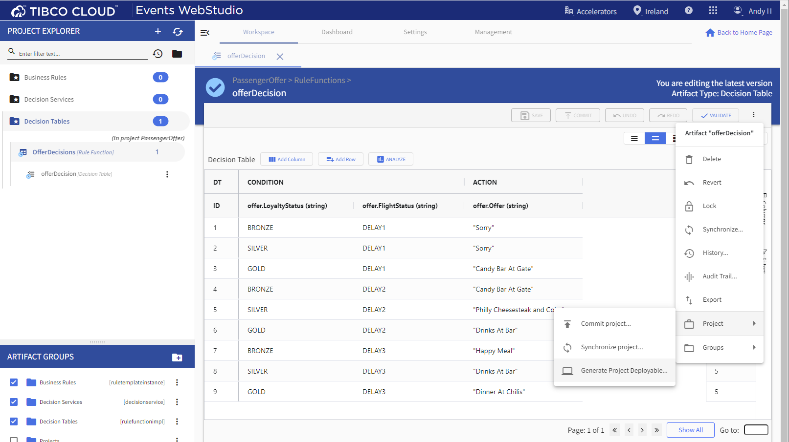

After a short wait it will say generated

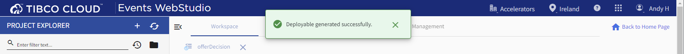

9) Next we need to Approve the change. Click **Approve** on the **Pending review card**

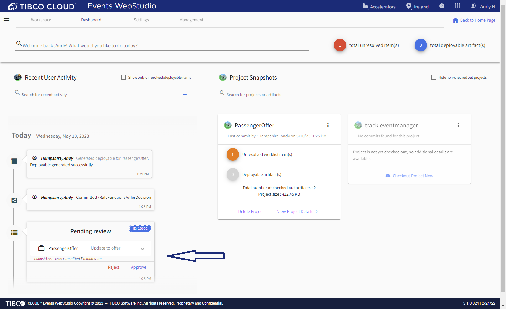

10) Click on either of the two blue artifact counts
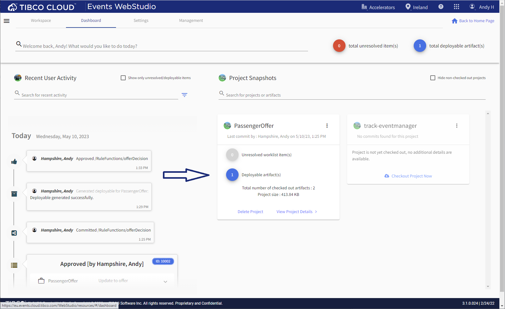

11) Expand PassengerOffer in the worklist and click the Deploy Button
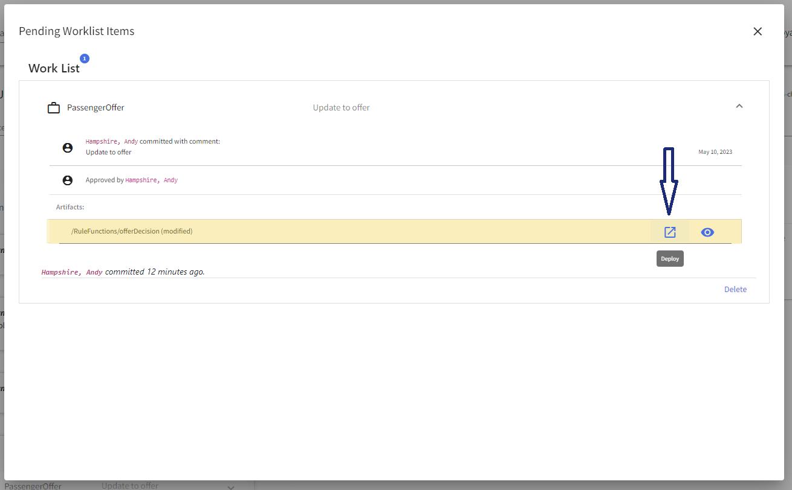

12)	After a few minutes a message will aperar saying Deployed... 
**NOTE: As of when this was written there is NO indication the Deploy button has done anything... Please be paitient !**
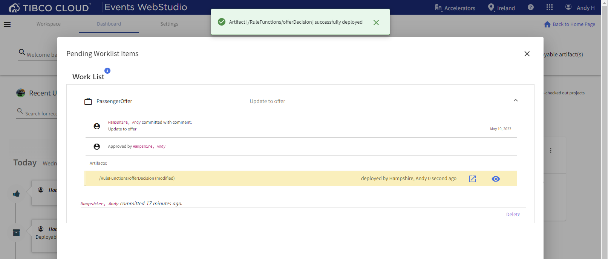

## Testing PassengerOffer Changes

1)	Navigate to the Cloud Events Apps list and select 2 Endpoint PassengerOffer - /swagger.
2)	Expand GET Method and select Try it out.
3)	Enter values for parameters as before and press Execute.
4)	The offer for a Silver member delayed by 2 hours is now  "Philly Cheesesteak and Coke".

## Summary
In this exercise you imported a cloud events project, made changes to decision tables and tested PassengerOffer API.  

Next step: [Cloud Analytics](5.analytics.md)  
