# Working with TIBCO Cloud Messaging

## Overview
In this hands-on lab you will set up Cloud Messaging so that you can read and write from a messaging destination

### Prerequisites
Validate the Messaging is an active part of your subscription
### Get Started

Start by signing into TIBCO Cloud and opening Messaging.


### Lab Steps
1)	Start on the Home page of your TIBCO Cloud
2)	Select Messaging
3) This will show the messaging home page
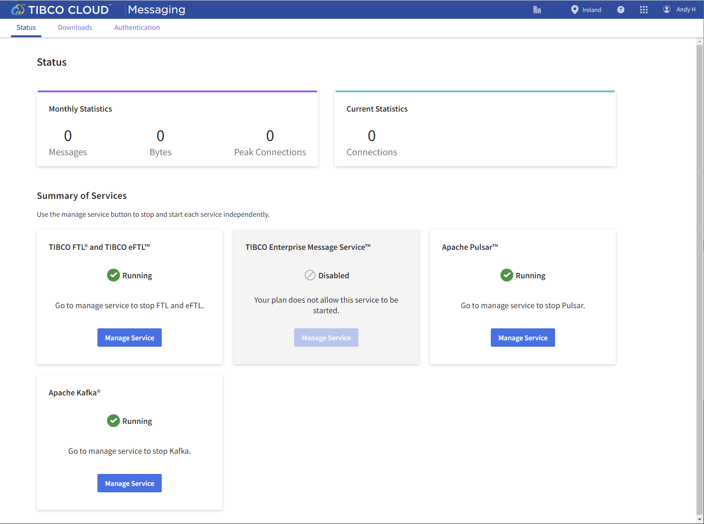

4) Click on **Authentication** in the page menu. 
This will display the role manager. You can create a new role if you wish but for this exercise you can simply used the existing **default** role. Click the Download link next to **channel**. This will download a configuration yaml file. Open this file in a text editor as you will need it later.


5) Go back to **Integration** and Click on **Connections**. Click **+ Create** 


You will be asked what type of connection you want to create. Find and Select **Apache Kafka Client Connection** in the list of available connectors.


6) Fill in the connector values from your downloaded yaml file. The values in the example below are truncated to illustrate the fields you will need ....
```
# label: default role with no restrictions
tcm_authentication_id: default
tcm_authentication_key: eyJh...sInR
eftl_url: wss://01..ca-apps.eu.messaging.cloud.tibco.com/channel
ftl_url: https://01..ca.eu.messaging.cloud.tibco.com:10207
ftl_application: channel
ftl_certificate: -----BEGIN CERTIFICATE-----\nMIICHTCC...yva+ZsI/E=\n-----END CERTIFICATE-----\n
pulsar_url: pulsar+ssl://01..ca-apd.eu.messaging.cloud.tibco.com:10209
pulsar_namespace: 01H01FZ..4CA/channel
kafka_broker: 01h0..ca-akd.eu.messaging.cloud.tibco.com:10208
kafka_username: 01H0...4CA/channel
kafka_password: token:eyJh....upkObKg
```
Enter the last three kafka_xxxx values into the  panel fields **Broker**, **Username** and **Password**.
Set the **Auth Mode** to **SASL/PLAIN**  


Set Security Protocol to SASL_SSL


7)  Navigate back to Apps. And lets create a new Flogo App. Lets call it TCM_Demo.


8)  Click **Create** to create our first flow.
Select **Trigger** in the left hand menu. In the panel find **Timer Trigger**


9)  Click on **New Flow**


10)  Create a new flow and name it **SendMsg**


11)  Click on the **Timer icon** in the trigger list on the left hand side.
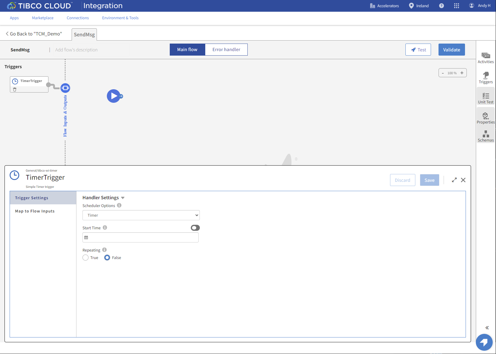

12)  Change **Repeating** to **True**
Set a Time interval. For example, 5 Seconds.


13) Our first Flow activity will be a Mapper. This will be used to create our message structure.
Find the Mapper in the Add Activity window. It might be in the recently used list. You might need to use the Search box or you could navigate to the **General** collection.
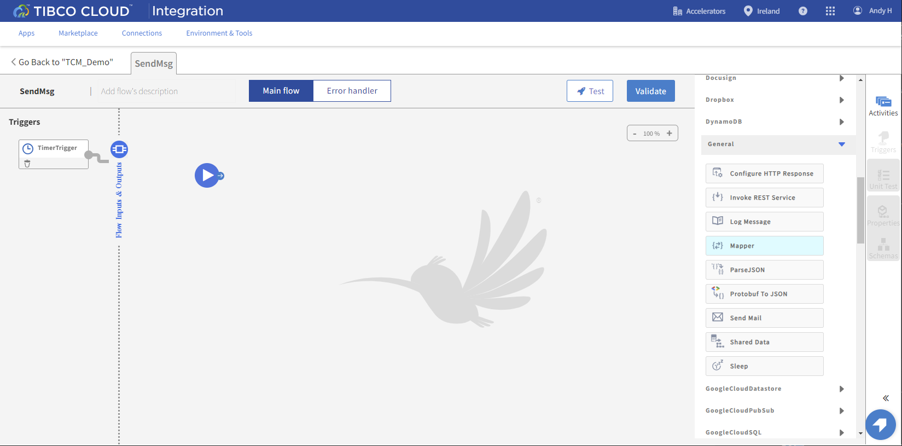

14)  On the **Input Settings** tab click the Toggle to use a schema for the data format.


15)  At the moment this app doesn't have any defined schemas, so we need to add one.
Click the **Add schema** button. 
Give the schema a meaningful name.
In the schema format you can either enter a valid JSON schema or you can give it some sample data to generate a schema from.
Let's enter some sample data as follow:
```
{
"demo_msg": {
	"date": "",
	"time":	"",
	"random_num": 123456
	}
}
```
Click **Save**


16)  Now Click Select next to the schema that just been added.


17)  We now need to map some data to our sample.
Hint - Either use the **Add Function** button or simply start typing the function name for a list.
Set **date** to `datetime.currentDate()`
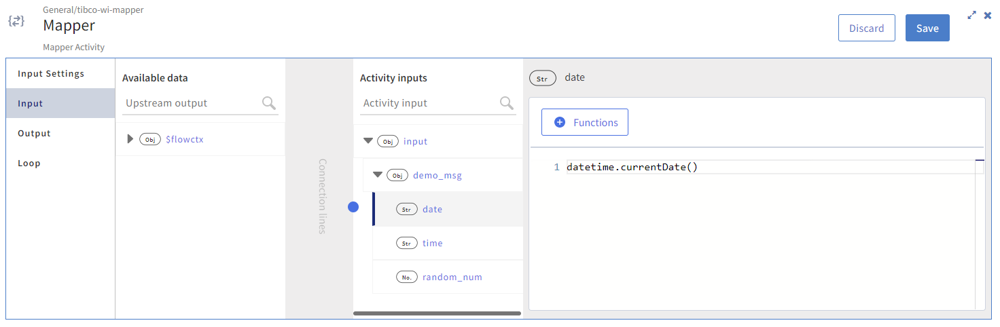
Set **time** to `datetime.currentTime()`
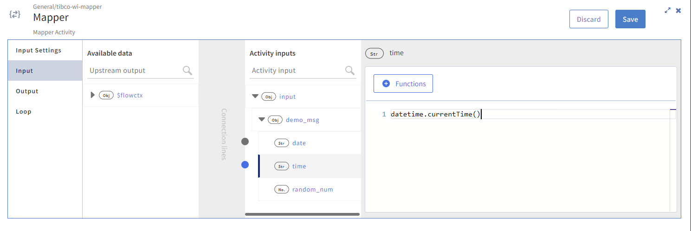
And finally generate a random number with `number.random(999999)`
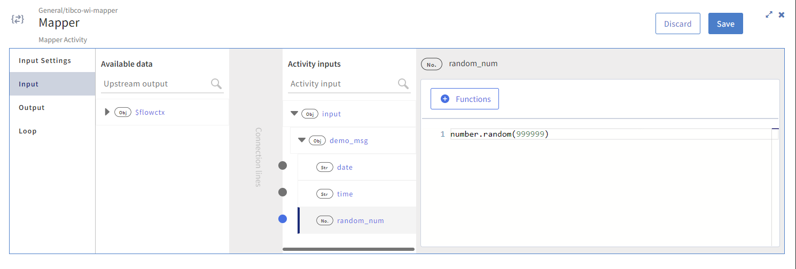

18) Our next Flow activity will be the **Kafka Producer** that will send the message. 
Find the Producer in the Add Activity window. It might be in the recently used list or you might need to use the Search box or you could navigate to the **Kafka** collection.
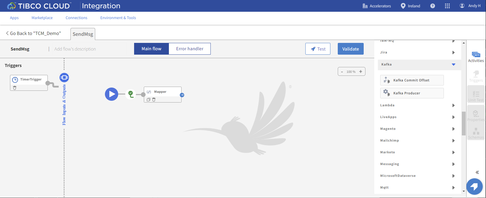

19)  In the **Settings** tab, select the **Kafka Client Configuration** details we set up earlier.
Change the **Value Serializer** to **JSON**
You can review the other available settings and you can find more information on the activities documentation page.


20)  Move to the **Input Settings** tab and set the message schema. Check the toggle and select the schema we added earlier


21) Move to the **Input** tab where we need to map the output from the Mapper activity to the producers **jsonValue** field. You can do this by dragging the Mapper **output** object to the **jsonValue** object. This will map all of the child elements.
The flow definition is now complete
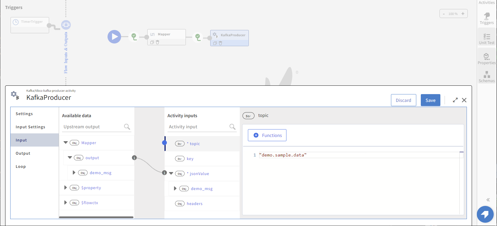

22)  Lets **Create** the second Flow. 
Select **Trigger** in under **Create new**
Find **Kafka Consumer** in the Trigger list and select it


23)  Configure the Trigger
Select the Kafka Connection you created earlier
Click **Continue**


24)  Click **Copy schema** so that we have all of the available trigger values passed to our Flow.


25)  Click on the Kafka Consumer settings icon. Note the Error and warning flags!


26)  Set the Topic name to `demo.sample.data`
Provide a Consumer name. Try to make this unique. We will use the convention App Name_flowname
Change the Value Serializer to JSON
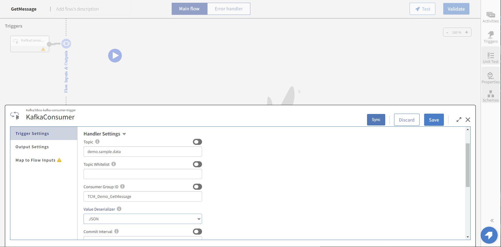

27)  On the the **Output Settings** tab, select our configured Schema.
**IMPORTANT** - Click the Sync button in the top right. This will ensure that configured outputs from the Trigger are reflected in the inputs to the flow.
If you don't do this some field names will be missing in the next step !!
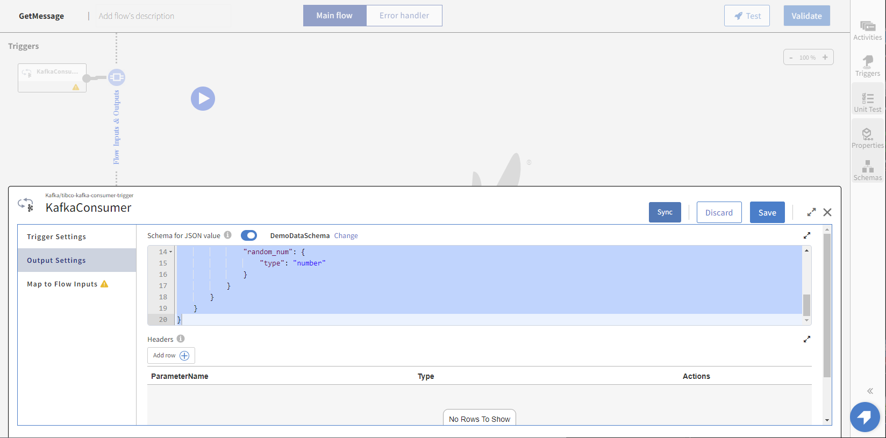

28)  On the **Map To Flow Inputs** tab map each of the matching field names
Click Save
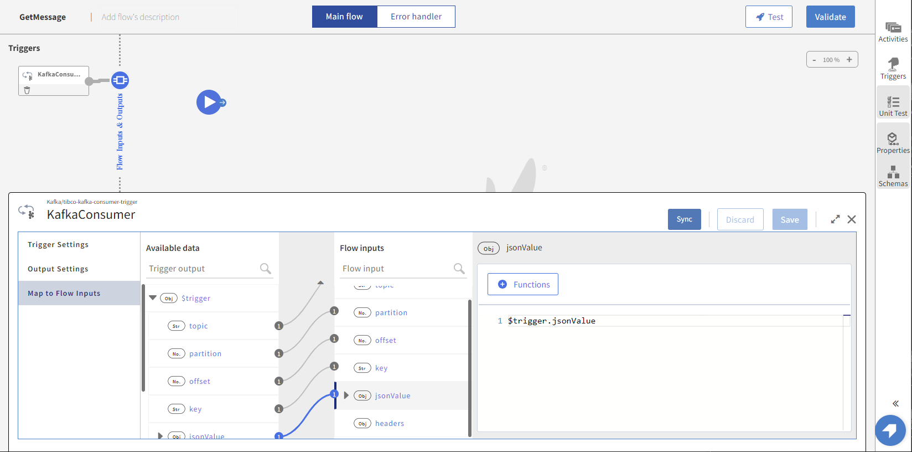

29)  Add a LogMessage activity to write the received message data to the log.
Map this however you like... But this is how we did it...
```
string.concat("Topic: ", $flow.topic,
   " Partition: ", string.tostring($flow.partition),
   " Offset: ", string.tostring($flow.offset),
   " Key: ", $flow.key,
   " Data: ", string.tostring($flow.jsonValue.demo_msg))
```


30) Push the completed app and scale the app to start it
Every 5 seconds (or the values you set!) the Timer event will trigger and send a message to Kafka.
The GetMessage flow will fire for each message that is sent and print the values in the log
Look in the log for the outputs.
Also explore the Monitoring Tab to see the data that available under each of the the tabs.


32)  Stop the App !! 


Next step: [Import Offer API Engine](5.TCE.md)