# Cloud Analytics

## Overview

In this hands-on lab you will use Cloud Analytics to explore the results of a customer airport satisfaction survey. 

## Get Started

Start by signing into TIBCO Cloud and opening Spotfire.  

1)	Start on the Home page of your TIBCO Cloud.
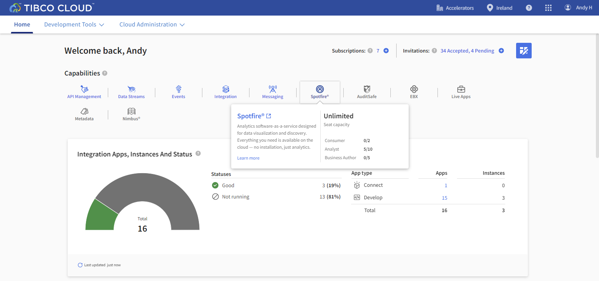

2)	Select Spotfire.

## Uploading a Spotfire Project

For this exercise we are going to start with a prebuilt analytics solution and upload the solution to your cloud.

**Steps:**

1)	Download [SFO GIS Analysis.dxp](https://github.com/TIBCOUK/Keys2Cloud/raw/master/project/analytics/SFO%20GIS%20Analysis.dxp)

1)	Select Browse Local file… 
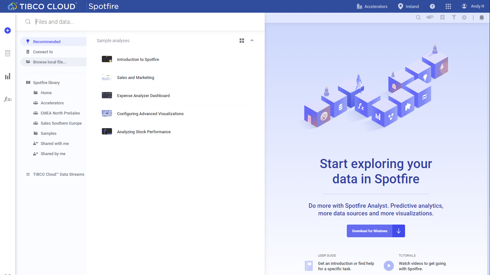

3) Select the file you just downloaded to open it in TIBCO Spotfire Cloud

## Exploring the Analysis

In this exercise you will explore the SFO Airport Survey results.

1)	Cloud Spotfire has opened to the analysis.
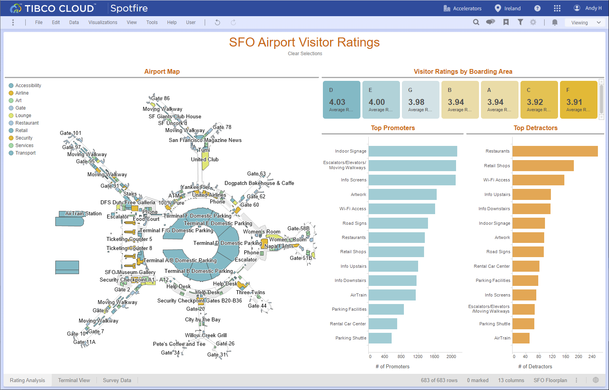

2)	You are ready to explore.
3)	Here you can see the results of a customer satisfaction survey.
4)	Try selecting a category such as Restaurant.  You will see the geo map of the airport highlight only Restaurants.
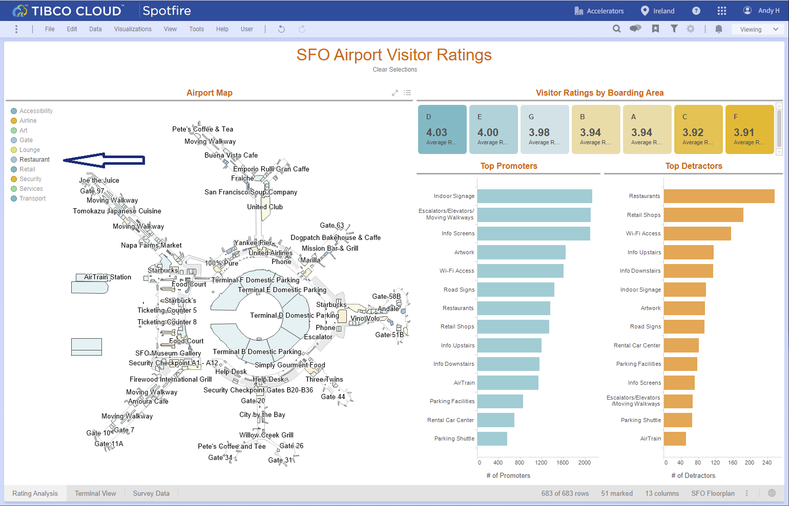

5)	Click on the background to select all categories.  Now under Top Promoters select art work.  The map will reflect the selection.
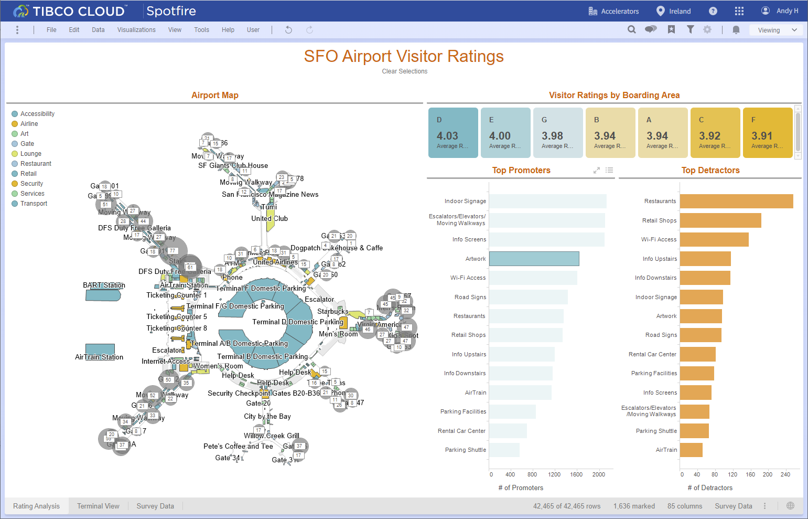

6)	Click on the tabs to see Terminal View and Survey Data.
7)	To save this analysis click on Viewing and select Editing.
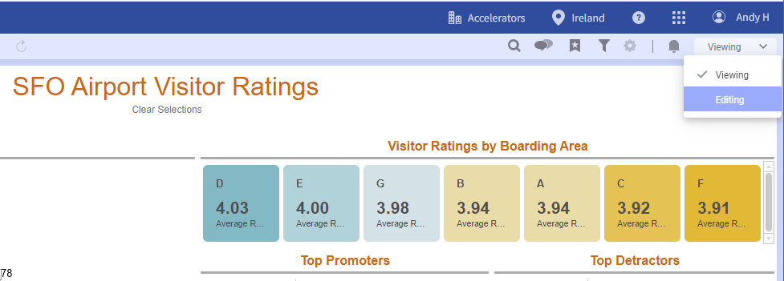

8)	Select File, select save and select save.  This will save this analysis to your library.
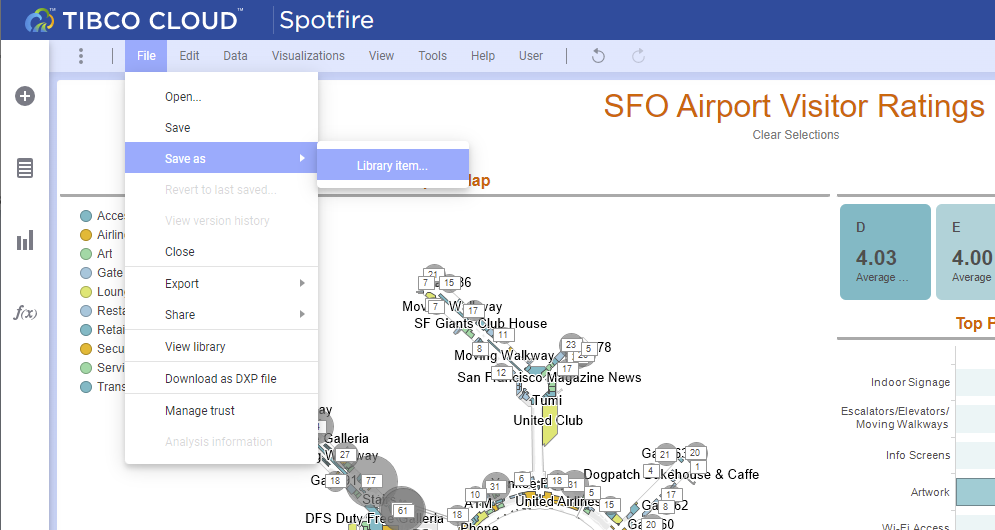

## Creating your Own Analysis

In this exercise you will be using natural language processing to create a pie chart to show survey Reponses.

1)	Click on + to add a new tab.
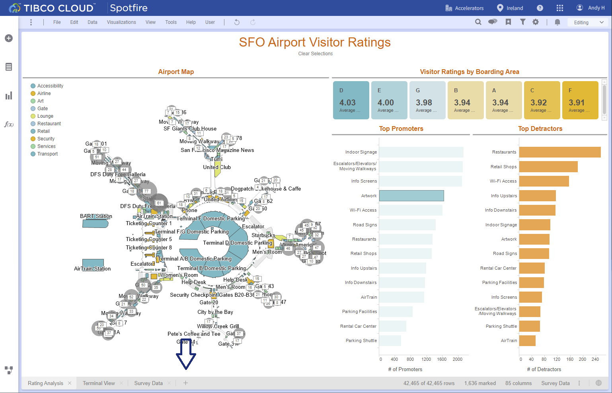

2)	Select Explore By Searching
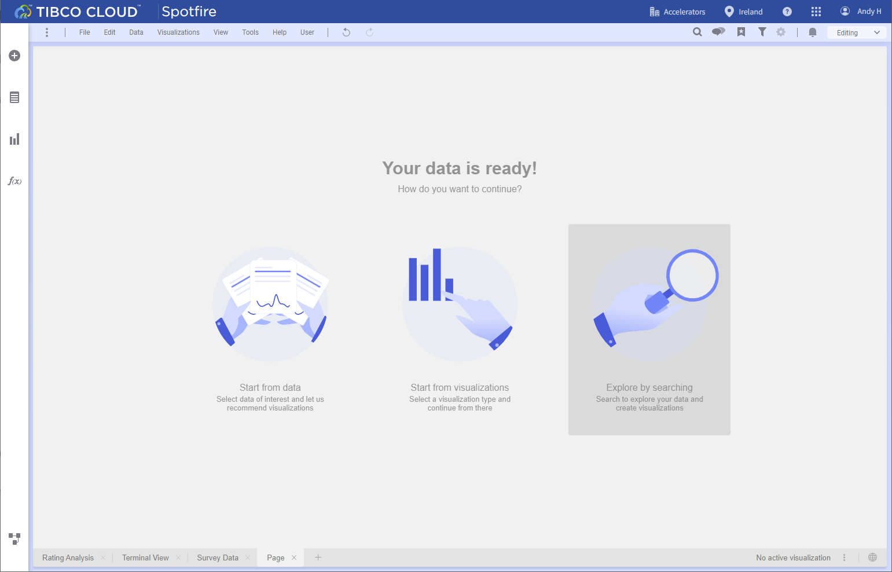

3)	In What are you interested in? type Female versus Male and select create pie chart.
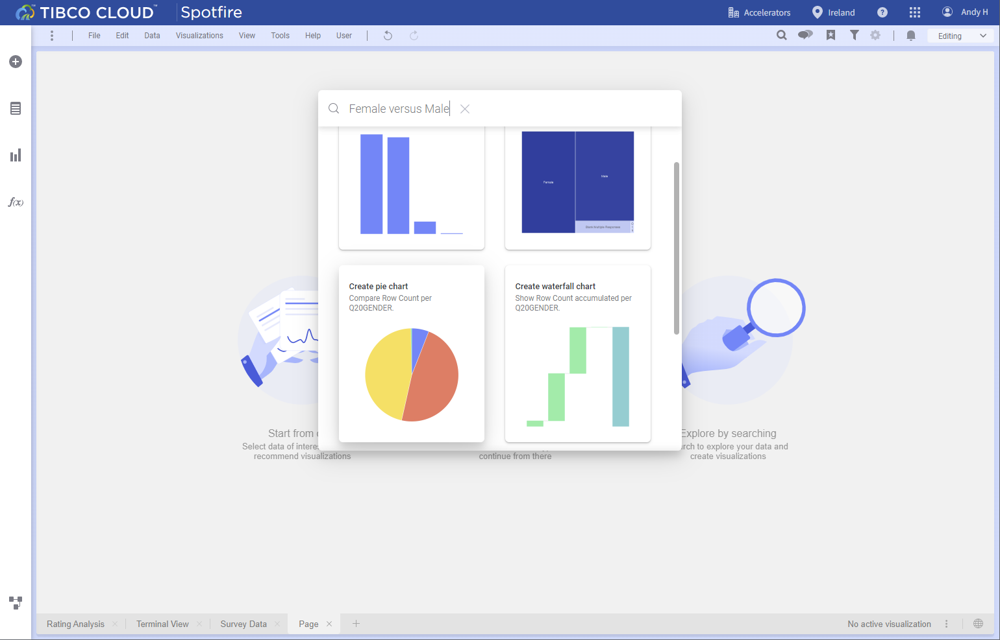

4)	A pie chart will be created showing the result of your query.
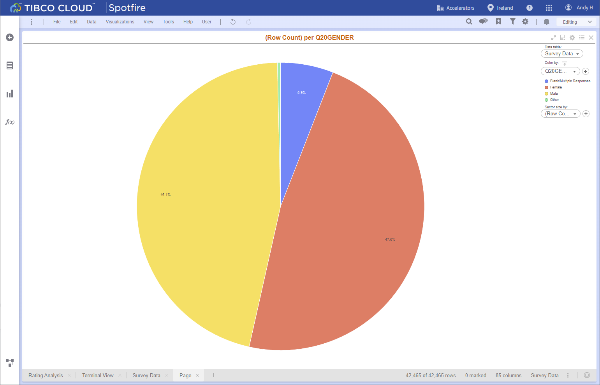

5)	Try other queries, select the spy glass icon in the upper right menu, and type Day and select create bar chart.

## Summary

We just saw how easy it easy to import an analysis to the cloud and use natural language processing to add visualizations. 

