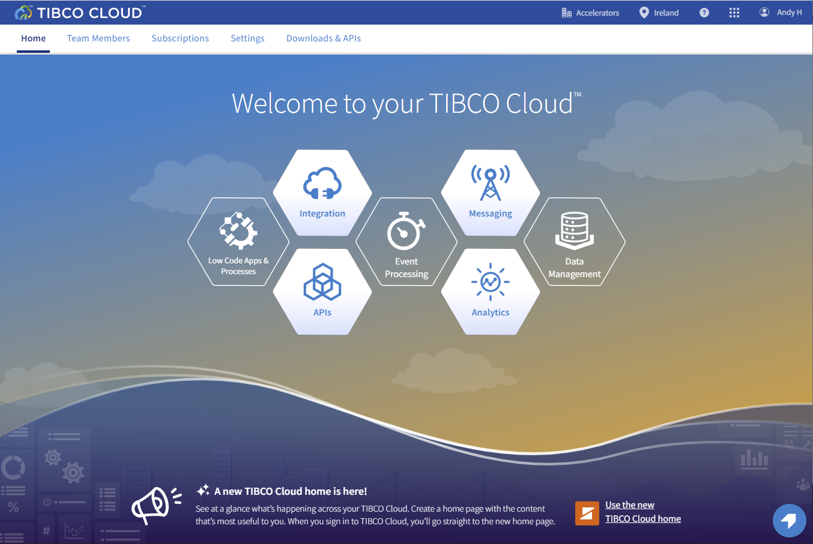
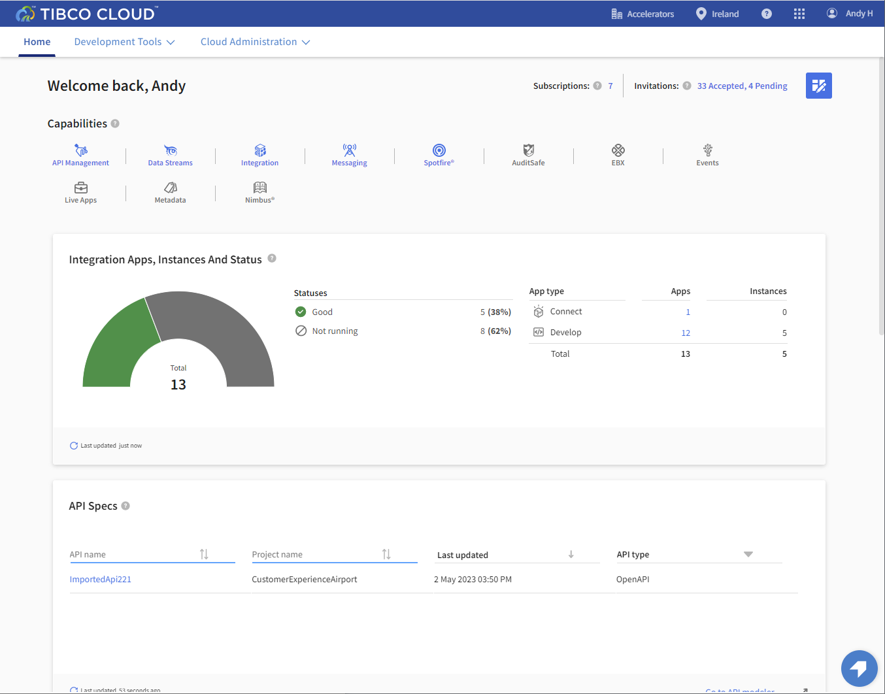

# Keys to the Cloud Workshop
This workshop will walk you through the basic features of TIBCO Cloud Integration by building some simple APIs
## Workshop Overview
[Import and Modify API Specification](0.apispec.md)  
[Create Mock API](1.mockapi.md)  
[Create API Implementation](2.apiimplementation.md)  
[Create Offer API](3.TCE.md)  
[Analyze Data](5.analytics.md)

**The workshop requires a TIBCO Cloud account.**  You can get started with a [free trial](trialsignup.md) in 30 seconds.  Or use the account that has provided to you by the TIBCO team.

### Getting started
When you first connected to the TIBCO Cloud you will be presented with the "hexagon" home page. 

(This will change to show the new home page as the default soon). We recommend that you switch to the new home page by clicking the "Use the new TIBCO Cloud Home" link. 

All the following instructions will assume that you are using the new menu layout!

  
Next step: [Import API Spec](0.apispec.md)
