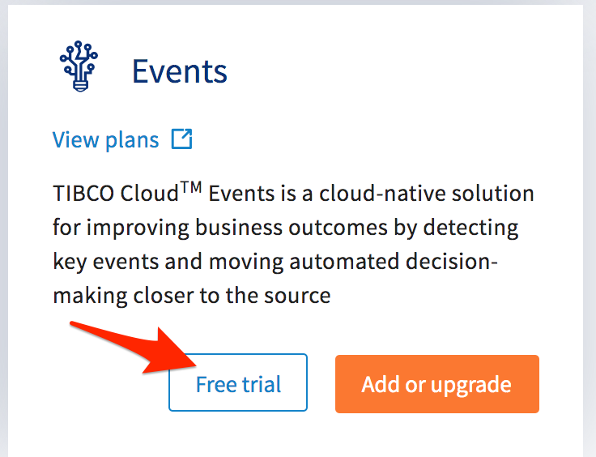

# Getting Started with TIBCO Cloud

The workshop requires a TIBCO Cloud account. Within that Cloud account, you'll signup to use **TIBCO Cloud Integration**, **TIBCO Cloud Events**, and **TIBCO Cloud Analytics**.

The following instructions walk you through getting your environment all setup.  In a new tab, follow this URL, [https://cloud.tibco.com/platform-capabilities](https://cloud.tibco.com/platform-capabilities).  Select **FREE TRIAL**

Enter your details, select the Platform (AWS or Azure) and be sure to enter a valid email address.  Your account will be provisioned and you will recieve a notification that your cloud environment is ready.  You'll receive an email to verify, activate, and set the password on your account.

Add the remaining subscriptions needed for the workshop, Spotfire and Events.  To add the additional capabilities, click on **Subscriptions**.

Click on the **Add Subscription** links.  Either link will work just fine.

Add Spotfire and Events to your trial by clicking on the **Free trial** button.

&nbsp;&nbsp;

That's it!  You're ready for the workshop.

Next step: [Start the Workshop with Importing an API Spec](README.md)
